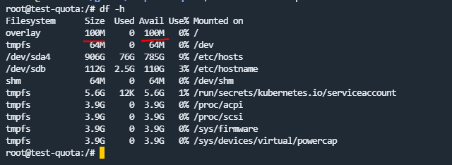

# Snapshots Quota

A Kubernetes NRI (Node Resource Interface) plugin that implements filesystem quota for container snapshots using project quota.

## Overview

This project provides a solution for managing filesystem quotas in Kubernetes containers by implementing a containerd NRI plugin. It uses project quota to set and manage storage limits for container snapshots, helping to prevent disk space issues in containerized environments.

## Features

- Implements filesystem quota for container snapshots using project quota
- Supports dynamic quota size based on pod ephemeral storage requests
- Label-based pod filtering for selective quota application
- Compatible with containerd's overlayfs snapshotter
- Health check probe for monitoring plugin status

## Installation

### Building from Source

1. Clone the repository:
```bash
git clone https://github.com/caizhengxin/snapshots-quota.git
cd snapshots-quota
```

2. Build the binary:
```bash
make build
```

### Building Docker Image

Build the multi-architecture Docker image:
```bash
make docker-buildx
```

### Deploying with Helm

1. Add the Helm repository (if available):
```bash
helm repo add snapshots-quota https://raw.githubusercontent.com/caizhengxin/snapshots-quota/gh-pages
helm repo update
```

2. Install the chart:
```bash
helm install snapshots-quota snapshots-quota/snapshots-quota
```

3. Customize the installation by creating a values file (e.g., `my-values.yaml`):
```yaml
image:
  registry: ghcr.io
  repository: caizhengxin/snapshots-quota
  tag: latest

nri:
  plugin:
    index: "99"
    name: snapshots-quota
    quota: 32212254720  # 30Gi in bytes
    use_ephemeral_storage: false
    enable_label_select: true
    label_select: "quota=enabled"
```

4. Install with custom values:
```bash
helm install snapshots-quota snapshots-quota/snapshots-quota -f my-values.yaml
```

#### Configuration Options

The following table lists the configurable parameters of the snapshots-quota chart and their default values:

| Parameter | Description | Default |
|-----------|-------------|---------|
| `image.registry` | Container image registry | `ghcr.io` |
| `image.repository` | Container image repository | `caizhengxin/snapshots-quota` |
| `image.tag` | Container image tag | `latest` |
| `nri.plugin.index` | Plugin index | `99` |
| `nri.plugin.name` | Plugin name | `snapshots-quota` |
| `nri.plugin.quota` | Default quota size in bytes | `32212254720` (30Gi) |
| `nri.plugin.use_ephemeral_storage` | Use pod ephemeral storage for quota | `false` |
| `nri.plugin.enable_label_select` | Enable label-based filtering | `true` |
| `nri.plugin.label_select` | Label select map | `"quota=enabled"` |

For more configuration options, see the [values.yaml](charts/snapshots-quota/values.yaml) file.

## Configuration

The plugin supports the following command-line flags:

- `--name`: Plugin name (default: "quota-injector")
- `--idx`: Plugin index (default: "00")
- `--quota`: Default quota size in bytes (default: 30Gi)
- `--containerd-state-dir`: Containerd state directory
- `--containerd-root-dir`: Containerd root directory
- `--containerd-base-path`: Containerd base path
- `--containerd-socket`: Containerd socket path
- `--containerd-namespace`: Containerd namespace
- `--use-ephemeral-storage`: Use pod ephemeral storage requests for quota size
- `--enable-label-select`: Enable label-based pod filtering
- `--label-select`: Label select map for pod filtering (format: key=value,key1=value1)

## Usage

### Running as a Container

1. Deploy the plugin as a DaemonSet in your Kubernetes cluster:

```yaml
apiVersion: apps/v1
kind: DaemonSet
metadata:
  name: quota-injector
spec:
  selector:
    matchLabels:
      app: quota-injector
  template:
    metadata:
      labels:
        app: quota-injector
    spec:
      containers:
      - name: quota-injector
        image: ghcr.io/caizhengxin/snapshots-quota:latest
        args:
        - --quota=32212254720  # 30Gi in bytes
        - --use-ephemeral-storage=false
        - --enable-label-select=true
        - --label-select=quota=enabled
        volumeMounts:
        - name: containerd-sock
          mountPath: /run/containerd/containerd.sock
        - name: containerd-state
          mountPath: /var/lib/containerd
      volumes:
      - name: containerd-sock
        hostPath:
          path: /run/containerd/containerd.sock
      - name: containerd-state
        hostPath:
          path: /var/lib/containerd
```

### Testing Quota

1.Create a pod with the required label:
```yaml
apiVersion: v1
kind: Pod
metadata:
  name: test-quota
  labels:
    quota: enabled
spec:
  containers:
  - name: test
    image: busybox
    command: ["sh", "-c", "while true; do sleep 3600; done"]
    resources:
      requests:
        ephemeral-storage: "500Mi"
```

2.Create a pod with the required label and annotation:

```yaml
apiVersion: v1
kind: Pod
metadata:
  name: test-quota
  labels:
    quota: enabled
  annotations:
    snapshots-quota: 100Mi
spec:
  containers:
  - name: test
    image: ubuntu:latest
    command: 
      - sleep
      - infinity
```



## Development

### Project Structure

```
.
├── cmd/
│   └── quota-injector.go    # Main application entry point
├── pkg/
│   ├── constant/           # Constants and default values
│   ├── quota/             # Quota management implementation
│   └── utils/             # Utility functions
├── docker/
│   └── Dockerfile         # Multi-stage Dockerfile
├── charts/
│   └── snapshots-quota/   # Helm chart
└── Makefile              # Build automation
```

### Building

```bash
# Build binary
make build

# Build Docker image
make docker-buildx

# Push Docker image
make docker-pushx
```
